# Visit Lévis and Québec City with children

This is a quick guide for family activities in Lévis and Québec City, plus some day trips and weekend trips.  I will break down the document between "Summer" and "Winter", then between  local activities, day trips and weekend trips.

# Summer  

## Local activities
- The [Festival d'Été de Québec](https://www.feq.ca/en/) is usually during the first half of July.  They bring in very well known bands on the main stage on the Plaines d'Abraham, but they also have a free show in Place d'Youville.  There will be a lot of activity in the streets, circus, etc..  As of January the schedule isnt out, but typically they have big names and the tickets are cheap (~100$ per person for 2 weeks).  
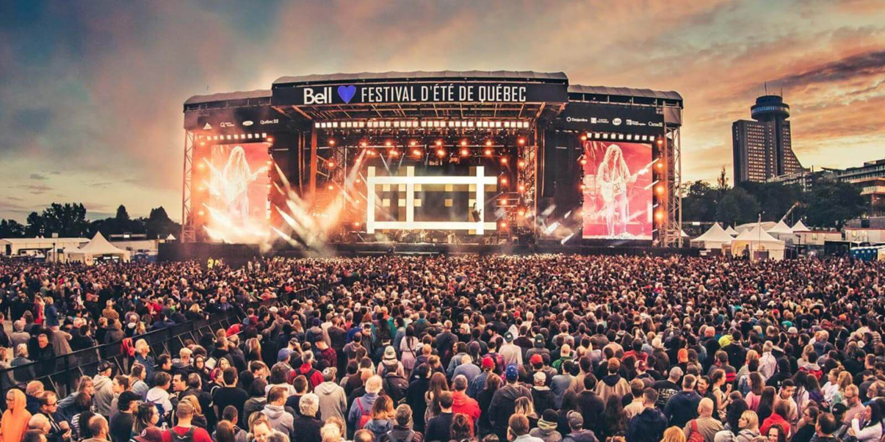
- The [Aquarium du Québec](https://www.sepaq.com/ct/paq/) is great with the kids.  Even though it seems like a great activity for rainy days, you may want to go on a sunny day because there is a lot to see outside.  This includes a polar bear, walruses, seals and even a small park to play in.  
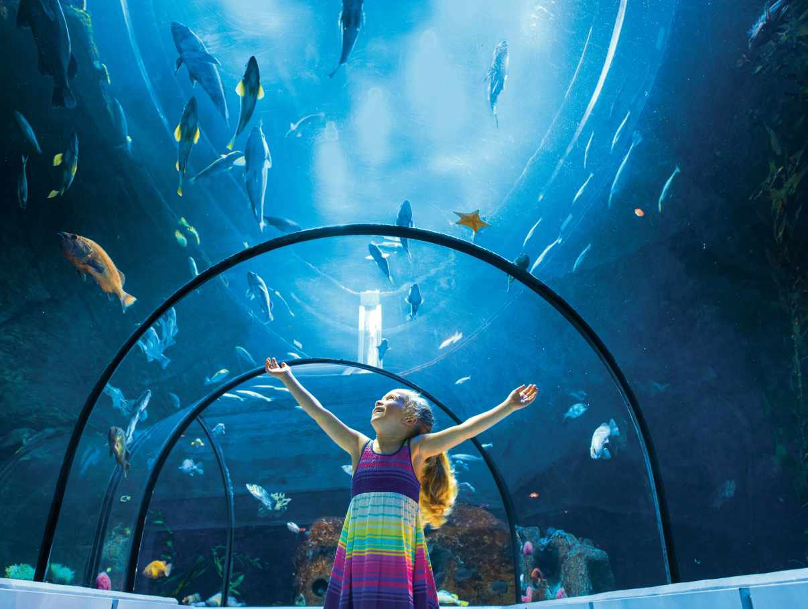
- Le [Musée de la Civilisation](https://www.mcq.org/en) is a great museum for rainy days.  There is a costume area downstairs where the kids can try a lot of costumes.  
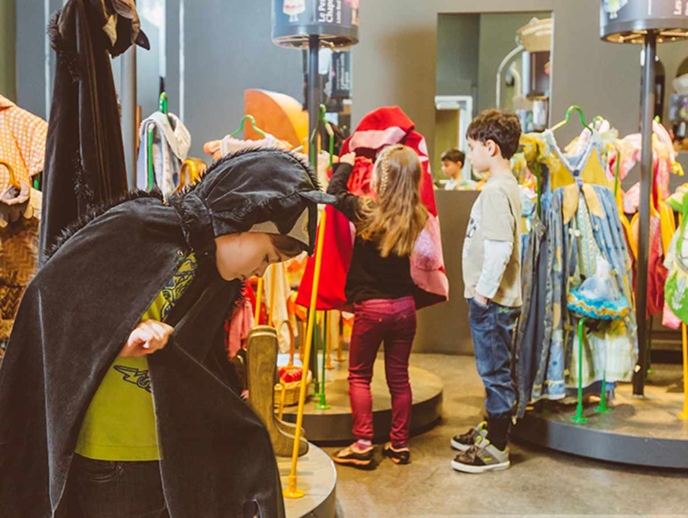
- Lévis has a network of [Grand Parcs](https://www.ville.levis.qc.ca/loisirs/installations-sportives/parcs/), which are large public parks.Each park has a unique flavour and is worth a visit.   
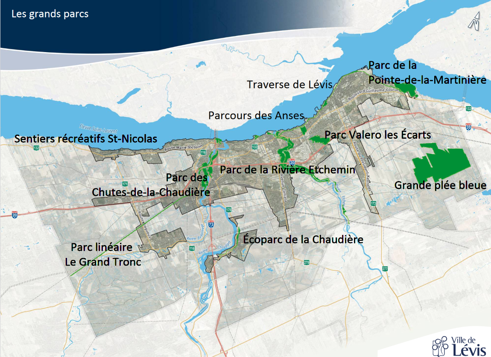

  - The "Parc de la Rivière Etchemin" is a forest in our backyard, so it is the one we visit the most.  We like to bike on the bike path, stop at the lookout and go to the "secret beach".   If the kids have good legs, we sometimes bike about 6km to buy a toy at [La Trouvaille](https://www.entraidestjean.org/boutique-la-trouvaille), a nice thrift store in the neighbouring village of Saint-Jean-Chrysostome. A network of network bike trails is currently being developed by [Sentier Vélos Lévis](https://sentiersvelolevis.ca/nos-sentiers) and you can reach it from our backyard.  

    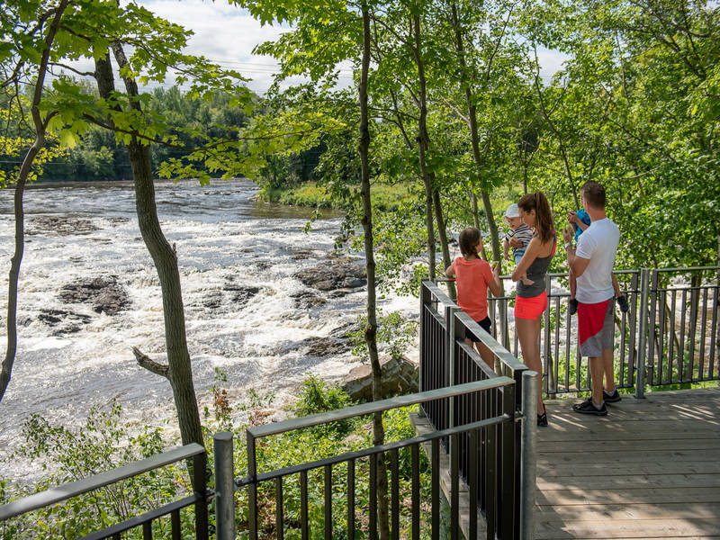    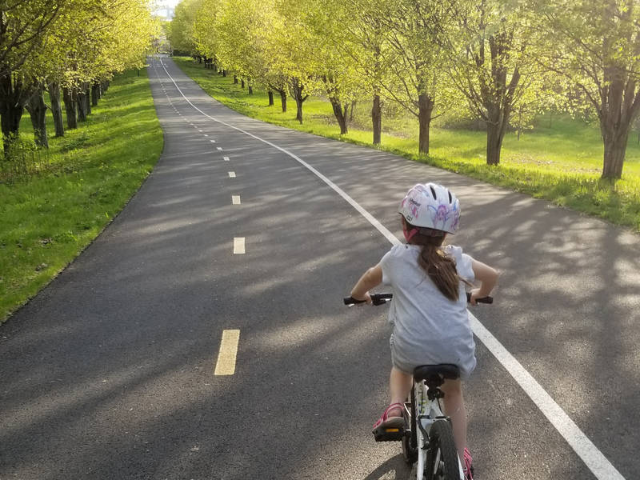

  - [The Parc des chutes de la chaudières](https://www.parcsnaturelsquebec.org/levis/chutes-de-la-chaudiere-est/parc-des-chutes-de-la-chaudiere/) has a pretty impressive waterfall and a bridge overlooking it.  
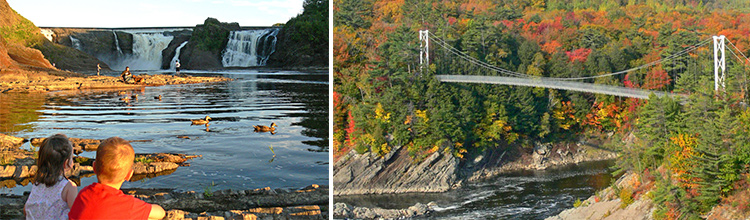
  - Le [Parcours des Anses](https://chaudiereappalaches.com/en/travel-quebec/levis/levis/parcours-des-anses/bike-path/) is a bike path that starts at our house and follows the St-Laurent towards the East.  It is very flat, and perfect for families.  
    - The first stop is the [Parc du Domaine-Etchemin](https://www.monsaint-laurent.com/fr/access-point?id=80), less than 1km in.  This area is popular with fishermen and has a nice pebble beach.  We try to arrive there at high tide because this is when the area looks best.  [Here are the tide tables](https://www.marees.gc.ca/eng/station?sid=3250).     
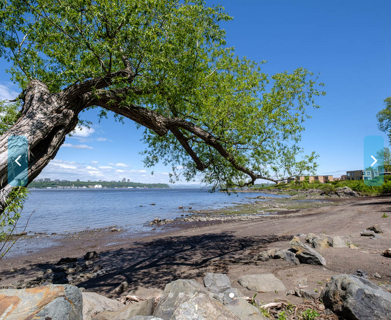    

    - We typically follow the Parcours des Anses  for 6 km to the [Parc de l'Anse-Tibbits](https://levis.chaudiereappalaches.com/en/travel-quebec/levis/levis/parc-de-l-anse-tibbits/park/) and have a picnic and let the kids play in the park.  There are "water games" at the park.  
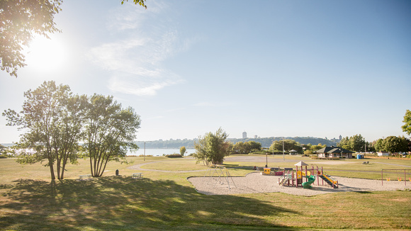
    - Sometimes we extends the trip a bit on the Parcours des Anses for a bit (7.7km one way) to the ferry and to the [Quai Paquet](https://www.ville.levis.qc.ca/loisirs/installations-sportives/quai-paquet/).  Last Summer they made "Water and Light shows" using the fountains at dark.  
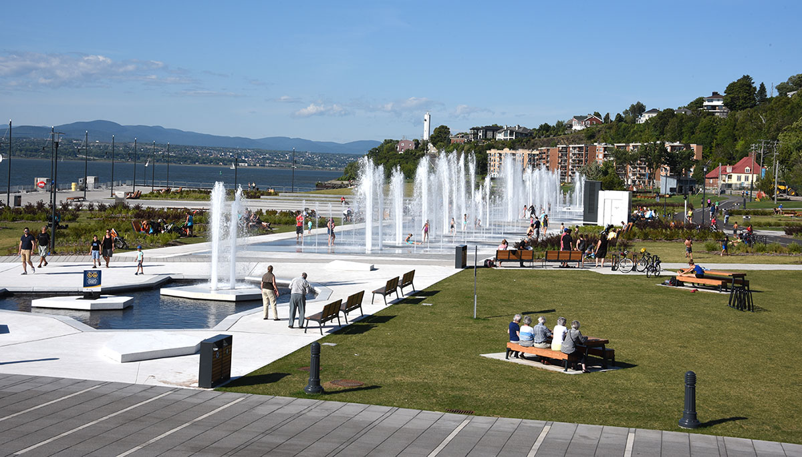
    - If you have good legs, you can make a very nice 29km loop:  bike to the ferry, cross the river, the follow a bike path on the opposite shore until you get to the Quebec bridge.  
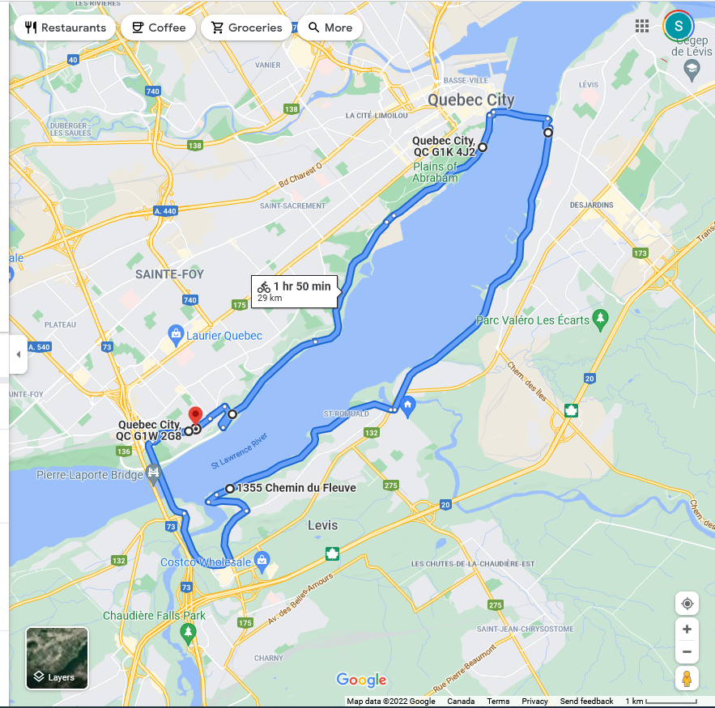

## Day trips

- [Valcartier Vacation Village](https://www.valcartier.com/en/activities/outdoor-waterpark/) has a great outdoor waterpark.  
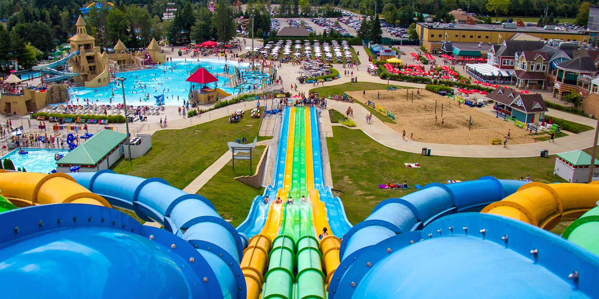  
- The [Miller Zoo](https://millerzoo.ca/) in Frampton.  
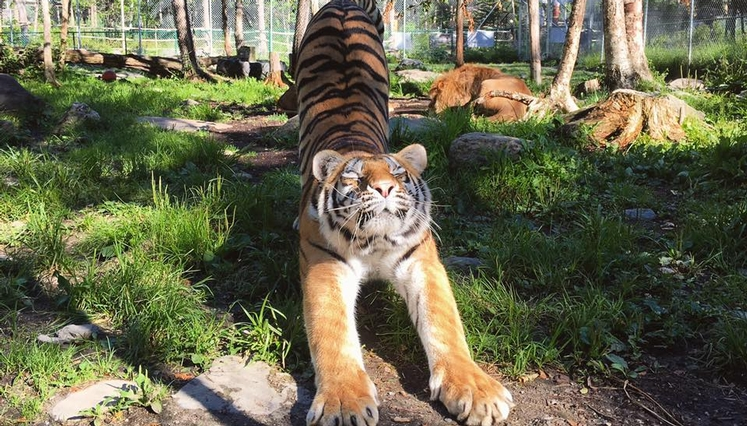  
- The [Woodooliparc](https://www.woodooliparc.com/) is a dinosaur-themed park located in Scott.  
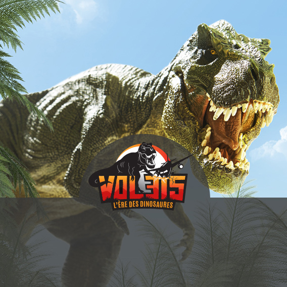  
- L'[Île d'Orléans](https://tourisme.iledorleans.com/en/what-to-do/) is always popular.  You can go on [sea kayaking tours](https://quatrenatures.com/sea-kayaking/discovery-the-ile-dorleans-sea-kayaking/), or just drive around the island.   There is a [chocolate shop](https://chocolaterieorleans.com/) in the village of Sainte-Pétronille and if you are there during the season you can go pick your own strawberries.  
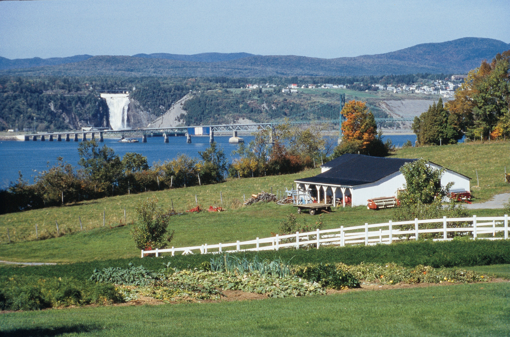    
- Le [Parc de la Chute-Montmorency](https://www.sepaq.com/destinations/parc-chute-montmorency/) is visible on the way to Ile d'Orléans.  At 83m high, it is a full 30m taller than Niagara Falls.  You can go for a climb of the stairs and a picnic, or the daredevils could try the zipline and he via ferrata.  There is also a "secret" walk to "les roches plates" (the flat rocks") where you can bask in the sun by the river and go fossil hunting.  
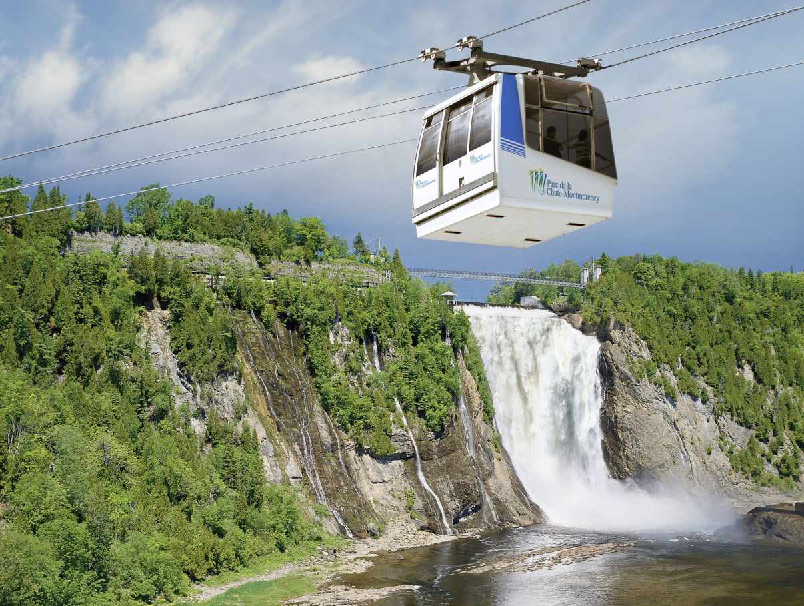    
- There is a lot of mountain biking in the area.  A network of bike trails is being developed by [Sentier Vélos Lévis](https://sentiersvelolevis.ca/nos-sentiers) in our litteral backyard.  The classics are all described [here](http://www.quebecregion.com/fr/velo-montagne/).  Empire 47 and Vallée du Bras du Nord are very beginner-friendly and even have kid-friendly trails.  
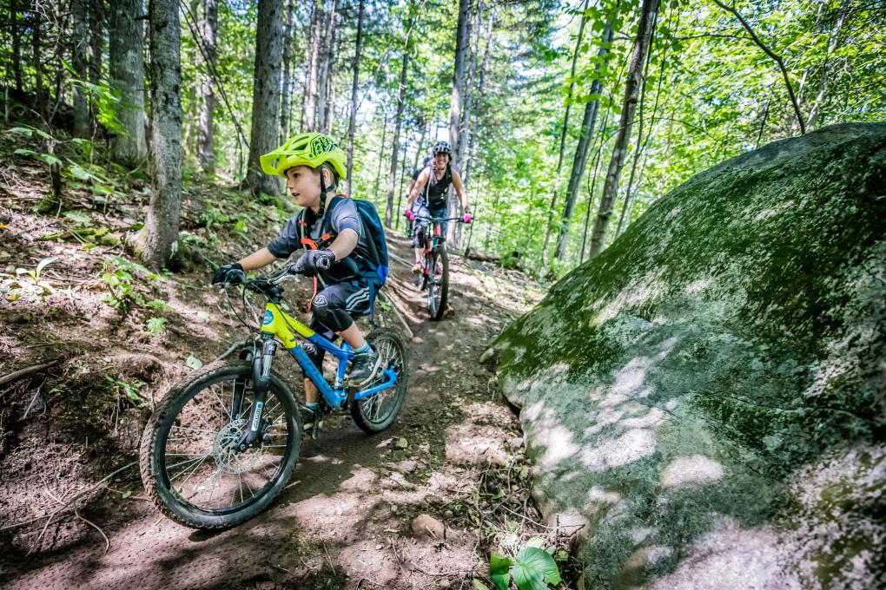    

- You can canoe down a river with your family:  
  - The [bras-du-nord river](http://www.valleebrasdunord.com/) has no rapid  A shuttle service is offered.  It is possible to camp along the river.  
  - The [Jacques-Cartier river](https://www.sepaq.com/pq/jac/)  section in Parc National de la Jacques-Cartier is beginner friendly.  It is mostly R1 and R2, with a single R3 that can be portaged.  The park rents canoes and offers a shuttle service.  I've seen mooses twice while doing that river.  It is also possible to camp on this river.  
  - The Montmorency River "section C" is even more beginner friendly, but is harder to find and you will have to bring a canoe and shuttle yourself.  I usually bring a bike and use it to ride back to my car.  
  - Intermediate-level canoeists will enjoy  the Jacques Cartier river (Pont-Rouge - Donnaconna area) and  the Montmorency river  (section B).  Mostly R2 and R3.
  - Advanced canoeists will enjoy the Grand-Remous and Tewksbury sections of the Jacques Cartier river and section A of the montmorency river (R3 and R4).  
  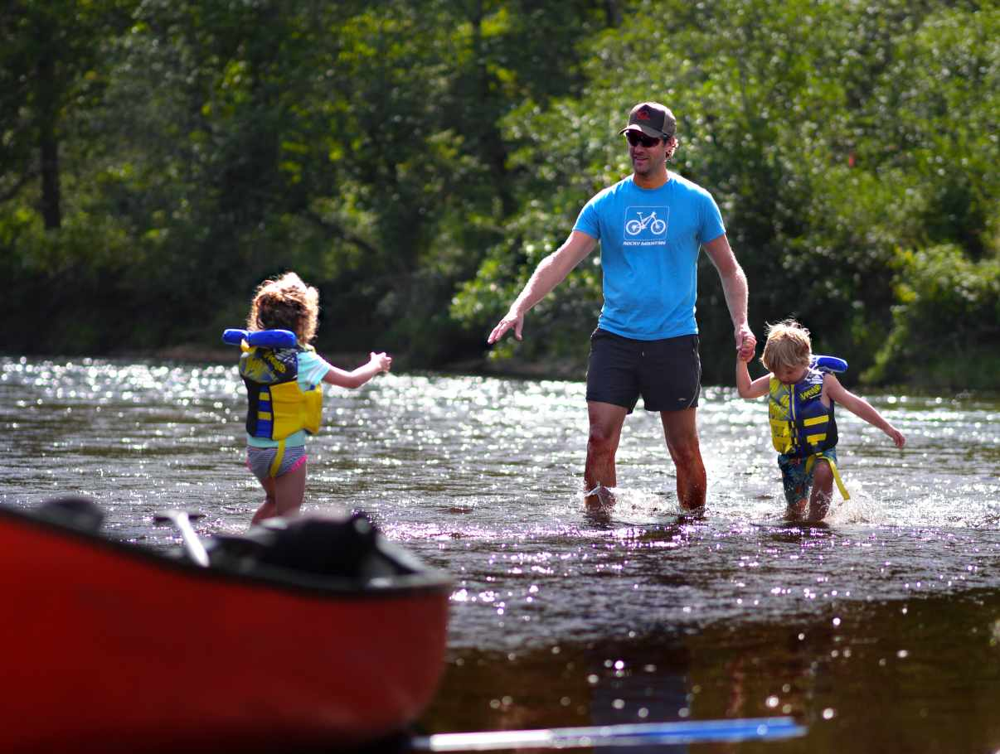  

## Weekend trips  

- Montreal is a world-class city and has a lot to offer.   The [Montreal Science Center](https://www.montrealsciencecentre.com/) was a hit with our kids.   
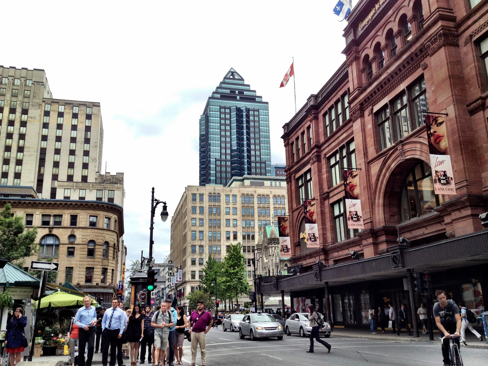  
- Le [Parc national du Saguenay](https://www.sepaq.com/pq/sag/) near Tadoussacis 3 hours away and is where you go when you want to see whales.   
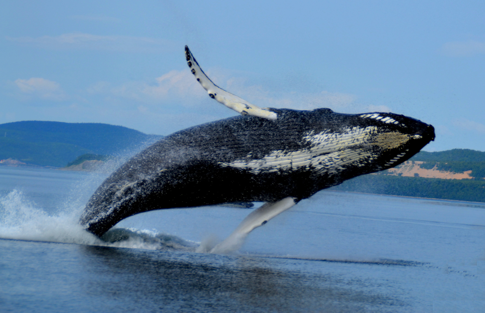  
- Le [Parc national du Bic](https://www.sepaq.com/pq/bic/index.dot?language_id=1) is 3 hours away and is where you go when you want to see seals.   
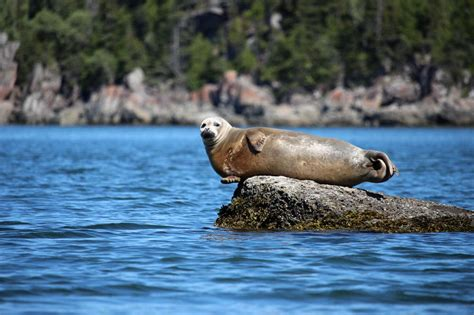  
- Le [Parc national des Grands-Jardins](https://www.sepaq.com/pq/grj/index.dot?language_id=1&utm_source=own-sepaq&utm_medium=print&utm_campaign=redirections-sepaq&utm_content=grj), le [Parc national des hautes-gorges de-la-rivière-malbaie](https://www.sepaq.com/pq/hgo/index.dot?language_id=1) and le [Parc national de la Mauricie](https://www.pc.gc.ca/en/pn-np/qc/mauricie) are other very interesting national parcs for hiking or canoeing.  

# Winter   (in progress)

## Local activities   
### Ski hills  
The area has 5 ski hills:    
 - The smaller hills (L[e Relais 225m](https://www.skirelais.com/) and [Stoneham 400m](https://ski-stoneham.com/en/)) are also open during the evenings for a quick outing. 
- The two larger one are [Mont Sainte Anne](https://mont-sainte-anne.com/en/) and le [Massif de Charlevoix](http://www.lemassif.com/). The Massif de Charlevoix is my personal favorite. It receives crazy amounts of snow and it looks like you are skiiing into the river 
- Finally, le [Massif du sud](http://massifdusud.net/)  is a different kind of animal. It is the highest one of the five, but it is also closed during the week and ungroomed. If you go there on a Friday and it snowed for the last 3 days, you get crazy amount of powder. They also do "alpine skiing" if you want to earn your powder :)

### Cross country skiing   

- You can actually put your skis on in our backyard and ski your way to the trails of  [Sentiers La Balade](https://lessentierslabalade.com/).

Honestly, there is so many places to practice cross country skiing within a half hour drive that I havent tried all of them yet.

### Fat Bike   

- You can reach the Fat Bike Trails of [Sentiers La Balade](https://lessentierslabalade.com/) from our backyard.  

## Day Trips  

## Weekend trips

# Sports for grown ups  
### Rafting   
- It is possible to raft down [the Tewksbury section of the Jacques-Cartier river](http://www.excursionsj-cartier.com/rafting-sportif.html)
### Rock climbing  
- The [Parc du Mont Wright]((http://www.fqme.qc.ca/images/stories/mont-wright.pdf)) I mentionned above (in hiking) also offers free rock climbing of all difficulty levels, and some bouldering as well 
### Road biking  
For bike tourers, National Geographic recently voted "La Route Verte" [the world's #1 cycle route](http://travel.nationalgeographic.com/travel/top-10/cycle-routes/).
### Kite Surf  
I am not familiar with that sport, but people practice it on the river both during the summer and winter (on the ice).